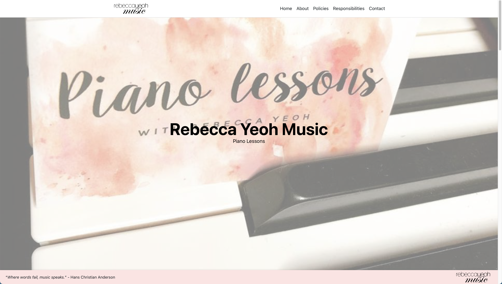

# 💻 Yukash Sivaraj – Software Developer  
  
  
  

---

## 👋 About Me  
Hello! I'm Yukash Sivaraj, a passionate software developer with a knack for solving complex problems and creating meaningful, user-focused applications. With experience spanning front-end and back-end development, I thrive in agile environments and love working with cutting-edge technologies to deliver scalable and secure solutions.

---

## 🚀 Technical Expertise  
**Languages & Frameworks**  
- **Frontend**: JavaScript, TypeScript, React.js, Next.js, Vue.js, HTML, Tailwind CSS  
- **Backend**: Node.js, PHP, Laravel, GraphQL, REST APIs  
- **Mobile Development**: Kotlin, Jetpack Compose, Android Studio  
- **Databases**: MySQL, MongoDB, CouchDB, Firebase  
- **Cloud & DevOps**: CI/CD workflows, Ansible, Vertex AI  

**Tools**  
- **Collaboration**: Confluence, Jira, Trello, Git  
- **Design & Animation**: Framer Motion, Next UI  
- **Testing**: Playwright, WebDriver IO, Appium  

---

## 📂 My Projects  

### 🎵 [Rebecca Yeoh Music](https://www.rebeccayeohmusic.com.au)  
A professional music website designed and deployed using **Next.js**, **React.js** in **TypeScript**, **Framer Motion**, and **Next UI** for a seamless user experience.  

---

### 🤖 OpenAI Integrated Chatbot  
Interactive chatbot built using **Next.js**, **React**, and **OpenAI** API for dynamic, conversational experiences.  

---

### 🐦 Twitter Sentiment Analysis  
Used **CouchDB** and **MapReduce** to process large-scale sentiment data, providing actionable insights.  

---

### 🛡️ Safe Circle Android App  
A mobile safety application developed with **Firebase**, **Google Maps API**, **Kotlin**, and **Jetpack Compose** for real-time location sharing.  

---

### 🗂️ CRM Web Application  
A custom CRM tool designed with **React**, **Node.js**, **Express**, and integrated with **Google Calendar API** for streamlined customer relationship management.

---

## 💼 Professional Experience  

### Software Developer | PS Design Studio (Contract)  
**May 2024 – August 2024**  
- Developed seven custom websites using **HTML**, **Tailwind CSS**, and **JavaScript** with CMS backends.  
- Built dynamic front-end components and APIs using **Vue.js**, **Nuxt.js**, and **GraphQL**.  
- Optimized a **Laravel Nova** database, reducing query complexity by 50%.  

---

### Software Engineer Intern | SideChef  
**February 2024 – May 2024**  
- Automated over 220 test cases for web and mobile using **Playwright**, **TypeScript**, and **WebDriver IO**.  
- Contributed usability solutions leveraging **Vertex AI** and **Claude 3** in a seven-member agile team.  

---

### Project Supervisor/Tutor | University of Melbourne  
**February 2024 – May 2024**  
- Mentored four agile student teams, guiding real-world software projects.  
- Evaluated and coached teams on tools like **Confluence**, **GitHub**, and **Jira**.  

---

## 📚 Education  
- **Master of Information Technology** (Distributed Computing) – University of Melbourne (2023)  
- **Bachelor of Science** (Computing & Software Systems) – University of Melbourne (2022)  

---

## 🌱 What I’m Learning Next  
- Advanced cloud computing with **AWS** and **Azure**.  
- Exploring **AI/ML** integrations in scalable web applications.  

---

## ✉️ Contact Me  
📧 **sivarajyukash@gmail.com**  
📱 **0431106869**  

---

### 🚀 Let’s Build Something Amazing Together!  
<!--
**YSPlop/YSPlop** is a ✨ _special_ ✨ repository because its `README.md` (this file) appears on your GitHub profile.

Here are some ideas to get you started:

- 🔭 I’m currently working on ...
- 🌱 I’m currently learning ...
- 👯 I’m looking to collaborate on ...
- 🤔 I’m looking for help with ...
- 💬 Ask me about ...
- 📫 How to reach me: ...
- 😄 Pronouns: ...
- ⚡ Fun fact: ...
-->
